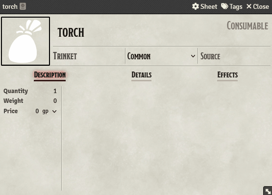

<a href="https://foundryvtt.com/packages/item-tags">
    

        
    

</a>

_**[Source](https://github.com/ZotyDev/FoundryVTT-ItemTags)**_

_⚠️ W.I.P ⚠️ - Information here may be incomplete_

---
A FoundryVTT library that provides a way to insert and manage tags across almost all documents.

This is useful for storing simple data that can help module/macro developers create generic code and reuse it easily, it also allows some type of customization. The idea of tagging Items was born because I don't use English in my sessions, and relying on autodetect based on names to automate certain items was going to be too much for me to handle.

**If you are a developer, you are looking for [this](./apiReference.md).**

### Supported documents:
- Item Sheets
- Actor Sheets

## Adding Tags
Open a supported document and find the `Tags` button, click it and insert the tag. All the changes you do need to be confirmed, if you click on cancel the changes you mader will be discarded.

    

## Removing Tags
Open the `Tags` button and click on the `X` on the tag you want to remove. You need to confirm when removing tags.

    

