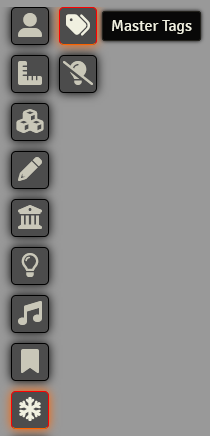
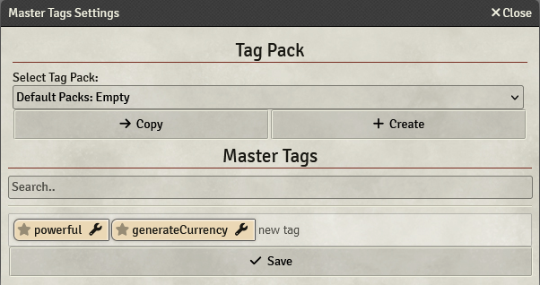

# Master Tags Customization

    
    

        <h3> Master Tags Settings </h3>
        
 The module registers a new tooltip to give easy access to the Master Tags Settings interface, which is responsible for providing a way to create and manage Tack Packs and Master Tags.

        
    

## Tag Packs
Tag Packs are collections of Master Tags, their purpose is to let you use, customize and maybe even distribute Tag Packs. Tag Packs can be changed while the game is running, so no need to restart and changes apply to all connected Players. Another important information is that Tag Packs, alongside Master Tags, are globally defined and only GMs can edit them.

The best use for these packs is to define Master Tags for different assets, you could define a `dagger` tag in two different Tag Packs, each one having different animations, delays and everything else that can be configured inside a Master Tag.

You can also **export** the Tag Pack as a `.json` file that will be save ond your `Downloads` folder, that means that you can also **import** Tag Packs from `.json` files.

> If you want to provide a Tag Pack with your Assets, you can take a look at the [API Reference](./apireference/tagPacks.md)
