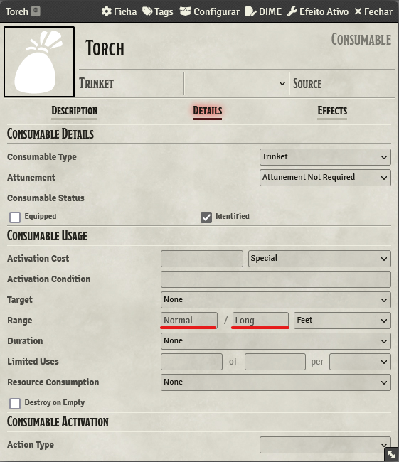

# Lighting Items
Lighting items are the easiest to setup. Pick a already existing tag or create a new one, them inser it into the item.

The tag does not know anything about the ranges, so you need to defined them at the item's details.
- `Bright Light` is the `normal` range
- `Dim Light` is the `long` range

    

Done! Now you can easily use your torches right from your inventory as a item, the bonus is that you can make a macro from your torch on your hotbar.
