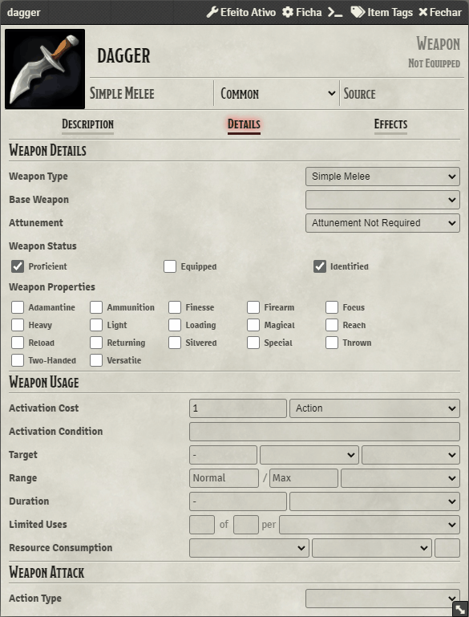

# Throwable Items
To setup throwable items you need to setup a weapon with the `Thrown` property set. You also need to define the `range` of the throwable item, you do that by simply setting the range property of the weapon, OIF will automatically check if the attack is ranged or not and will restrain the attack to the maximum range.

    

There you go, now when you do a attack with a melee weapon from a distance greate than the melee range, it will become a ranged attack, ~~all bonuses and everything is calculated for you, no need to worry about anything :D~~ _(W.I.P, take a look at the results just to be sure)_

The image for the dropped thrown item on the ground is the same image of the item, the same also applies for ammunition items.
